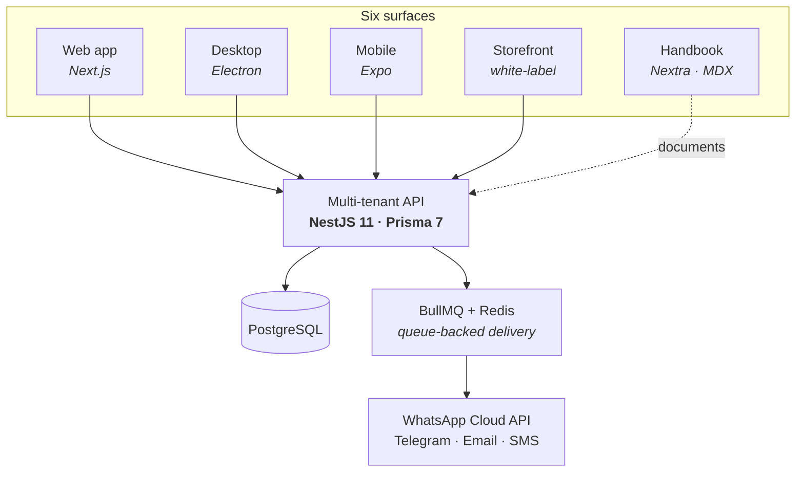

# Pushpraj Dwivedi

### Backend &amp; DevOps Engineer

**Systems that scale. Pipelines that ship.**

I build scalable, reliable systems — messaging infrastructure, multi-tenant
platforms, and the pipelines that ship them.

---

## 🛰 MsgBuddy — customer messaging platform

A production multi-channel messaging platform — **WhatsApp, Telegram, email and
SMS** — built and shipped end to end. Support and sales teams handle every
customer conversation and marketing campaign from one shared inbox, on the web,
desktop or phone.

Workspaces, contacts, a shared inbox, templates, campaigns, automation, a voice
agent and subscription commerce sit on **one multi-tenant API**, delivered
through five clients and documented in a full product handbook. It also ships as
a single-tenant build for enterprise customers.

| Surface | What it is | Built with |
| :-- | :-- | :-- |
| **API** | Multi-tenant core — JWT access tokens with rotating refresh, encrypted fields, queue-backed delivery, published OpenAPI spec | NestJS 11, Prisma 7, BullMQ, Swagger |
| **Web app** | The primary client. Short-lived access tokens refresh silently on `401` against HttpOnly rotating refresh cookies | Next.js, TypeScript, Axios |
| **Desktop** | macOS and Windows shell — persistent session, in-window OAuth, deep links, tray-resident realtime, auto-update | Electron, electron-updater |
| **Mobile** | React Native client sharing the same API surface as web and desktop | React Native, Expo |
| **Storefront** | White-label per-merchant subscription storefront. Tenant branding resolves server-side into CSS variables — no flash, pages stay indexable | Next.js, Server Components, WhatsApp OTP |
| **Handbook** | Customer-facing product manual — 17 chapters of plain-language guides, worked examples and 60+ diagrams | Nextra, MDX, Mermaid |

[**msgbuddy.com**](https://msgbuddy.com) · [**Web app**](https://app.msgbuddy.com) · [**Handbook**](https://docs.msgbuddy.com) · [**API docs**](https://api.msgbuddy.com/v2/docs)

---

## 🧱 Other work

<b>Synapse</b> — WhatsApp Business messaging microservice

 

Connects a company's existing systems to WhatsApp so it can send and receive
business messages reliably, at volume. A standalone service wrapping the Meta
Graph API — template-based outbound messaging, inbound webhook verification,
structured logging, rate limiting and request validation behind a typed
interface.

`TypeScript` `Express` `Meta Graph API` `Winston`

<b>The Panipat Handloom</b> — Django → TypeScript platform migration

 

Moved a handloom retailer's ageing online store onto a modern stack — without
losing a product, an order or its search ranking. Rebuilt a legacy Django
storefront as a pnpm monorepo: a NestJS API with OpenAPI, a Next.js 15
storefront and a React-Admin console, plus ETL scripts that carried the original
data across intact.

`NestJS` `Next.js 15` `React-Admin` `Prisma` `Neon Postgres`

<b>Bhartiya Aviation Services</b> — recruitment &amp; examination platform

 

Runs aviation recruitment end to end — applications, online exams, scheduling
and paperwork — for candidates and staff alike. Marketing site, candidate portal
and admin panel over a single backend, with a dedicated worker tier handling
email, PDF, CSV and calendar jobs.

`NestJS` `Prisma` `Next.js` `BullMQ` `Zod` `Docker`

<b>Vision360</b> — optical commerce &amp; franchise management

 

Lets an optical chain run stock, sales and franchise stores across many
locations from a single system. A Turborepo monorepo for multi-store retail,
sharing typed contracts between the API and web app so a React Native client can
reuse them later.

`Turborepo` `NestJS` `Next.js 15` `Prisma`

<b>Plan &amp; Book Trip</b> — travel booking &amp; package management

 

Sells and manages travel packages online, payments included, with an admin
console for the operator. Public booking site, admin console and payment
checkout, split into two independently deployed applications over a modular
monolith API.

`NestJS` `Prisma` `Redis` `BullMQ` `Razorpay` `Next.js 16`

<b>SearchArchitect</b> — architect listing &amp; hiring marketplace

 

Helps clients find and hire architects, with structured briefs that carry budget
and timeline from the first message. Architects publish and manage portfolios;
clients search and hire them through structured project requests.

`TypeScript` `NestJS` `PostgreSQL` `React`

<b>NestJS Production Template</b> — the starter behind the above

 

A batteries-included NestJS starter for real SaaS workloads — ESM, strict
TypeScript, Zod-validated environment config, Prisma, Redis, queues and auth
wired up from the start.

`NestJS` `ESM` `Zod` `Prisma` `Redis`

---

## 🧰 Stack

| | |
| :-- | :-- |
| **Backend** |      |
| **Frontend** |      |
| **Data** |     |
| **DevOps** |      |

---

## 🤝 What I take on

- **Platform build-out** — design and ship a multi-tenant product end to end: API, web, mobile and desktop clients, auth, background jobs, payments and documentation.
- **Legacy migration** — move an ageing PHP, Django or Laravel system onto a modern TypeScript stack, carrying the existing data across intact.
- **Messaging &amp; WhatsApp integration** — WhatsApp Business and Cloud API work: template messaging, inbound webhooks, bulk delivery, rate limiting and retry handling.
- **DevOps &amp; delivery** — dockerised environments, CI/CD pipelines, VPS deployment and process management, so shipping stops being an event.

 

**Open to remote or hybrid backend / platform roles.**

🌐 [pushpraj-rmx.github.io](https://pushpraj-rmx.github.io/) &nbsp;·&nbsp; ✉️ [pushprajdwivedi001@gmail.com](mailto:pushprajdwivedi001@gmail.com) &nbsp;·&nbsp; 💼 [LinkedIn](https://linkedin.com/in/pushpraj-rmx)

